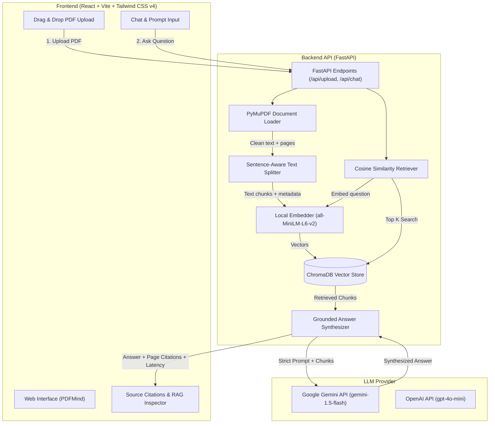

# PDFMind — PDF-Based RAG Question Answering System

> **Ask questions. Get grounded answers from your documents.**  
> A simple, clean, production-grade portfolio implementation of a **Retrieval-Augmented Generation (RAG)** pipeline with strict grounding, source page citations, and interactive RAG evaluation.

---

## 1. Project Overview

**PDFMind** is a full-stack AI application designed to demonstrate the practical mechanics of Retrieval-Augmented Generation. Users can upload any PDF document and ask questions about its contents. PDFMind parses the document, splits it into semantic chunks, generates vector embeddings locally using Sentence Transformers, indexes the chunks in ChromaDB, retrieves the most relevant chunks using cosine similarity, and synthesizes answers strictly grounded in the retrieved text.

---

## 2. Problem Statement

Standard Large Language Models (LLMs) suffer from:
1. **Knowledge Cutoffs**: They cannot answer questions about proprietary, local, or private documents.
2. **Hallucinations**: They often invent convincing yet false facts when lacking specific context.
3. **Lack of Verifiability**: Traditional chatbot answers do not cite exact page numbers or excerpts from the source document.

**PDFMind solves this** by restricting knowledge strictly to the uploaded PDF. If the requested information is absent from the document, the system explicitly returns:
> *"I couldn't find this information in the uploaded document."*

---

## 3. Key Features

- **End-to-End RAG Pipeline**: PDF text extraction, cleaning, sentence-aware chunking, local vector embedding, similarity retrieval, and grounded generation.
- **Strict Grounding & Zero Hallucination**: Guardrailed system prompts prevent the LLM from answering outside the retrieved document context.
- **Source Citations with Page Numbers**: Every answer cites exact source pages (e.g., `Page 2`, `Page 3`) and lets users expand and inspect the exact chunk excerpts and similarity scores.
- **Local Embedding Model**: Uses `sentence-transformers/all-MiniLM-L6-v2` running entirely on your machine (zero external embedding API costs or latency).
- **ChromaDB Vector Store**: Fast, persistent cosine similarity search with automatic active document replacement.
- **Configurable Multi-Provider LLM**: Pre-configured for **Google Gemini API** (`gemini-1.5-flash`), with support for **OpenAI** (`gpt-4o-mini`) and an offline extractive fallback if no API key is set.
- **RAG Inspector & Evaluation Modal**: Real-time evaluation view displaying query latency in milliseconds, retrieved chunk ranking, cosine similarity percentages, and grounding verification.
- **Modern Responsive UI**: Built with React, Vite, and Tailwind CSS v4 featuring dark glassmorphism, drag-and-drop file upload, and suggested prompt chips.
- **Bundled Sample Document**: Includes a 5-page Computer Science & Data Structures guide (covering AVL trees, BSTs, Hash Tables, and Graph traversals) for 1-click testing.

---

## 4. Architecture Diagram



---

## 5. RAG Pipeline Mechanics

The application follows a 10-step retrieval pipeline:

```
PDF Upload
  ↓
PDF Text Extraction (PyMuPDF extracts page-by-page text)
  ↓
Text Cleaning (Normalizes whitespace, Unicode characters, and formatting)
  ↓
Sentence-Aware Chunking (~600 chars/tokens with ~120 overlap, avoiding mid-sentence cuts)
  ↓
Embedding Generation (sentence-transformers/all-MiniLM-L6-v2 running locally)
  ↓
Vector Storage (ChromaDB indexes chunk vectors and page metadata)
  ↓
User Question Embedding (Question encoded into 384-dimensional dense vector)
  ↓
Cosine Similarity Search (Retrieves Top 4 most relevant chunks)
  ↓
LLM Context Injection (Strict prompt restricts reasoning to retrieved excerpts)
  ↓
Answer + Source Page Citations (Displays synthesized answer with clickable source pages)
```

---

## 6. Technology Stack

### Frontend
- **Framework**: React 19 + Vite
- **Styling**: Tailwind CSS v4
- **Icons**: Lucide React
- **HTTP Client**: Native Fetch with Vite proxy

### Backend
- **Framework**: FastAPI (Python 3.11 / 3.12)
- **Server**: Uvicorn
- **PDF Extraction**: PyMuPDF (`pymupdf`)
- **Embeddings**: Sentence Transformers (`all-MiniLM-L6-v2`)
- **Vector Database**: ChromaDB
- **LLM SDKs**: `google-genai` (Google Gemini) and `httpx` (OpenAI fallback)
- **Validation**: Pydantic v2 & Pydantic-Settings

---

## 7. Installation & Setup

### Prerequisites
- **Python 3.11+** (Python 3.11 or 3.12 recommended)
- **Node.js 18+** and **npm**

### Step 1: Clone the Repository
```bash
git clone https://github.com/your-username/pdfmind.git
cd pdfmind
```

### Step 2: Backend Setup

1. Create a Python virtual environment and activate it:
   ```powershell
   # Windows (PowerShell)
   python -m venv .venv
   .\.venv\Scripts\activate

   # Linux / macOS
   python3 -m venv .venv
   source .venv/bin/activate
   ```

2. Install Python dependencies:
   ```bash
   pip install -r backend/requirements.txt
   ```

3. Configure environment variables:
   ```powershell
   # Windows
   cp backend/.env.example backend/.env

   # Linux / macOS
   cp backend/.env.example backend/.env
   ```

4. Add your **Google Gemini API Key** inside [backend/.env](file:///c:/Thamizh/RAG/backend/.env):
   ```env
   GEMINI_API_KEY=your_actual_gemini_api_key_here
   LLM_PROVIDER=gemini
   GEMINI_MODEL=gemini-1.5-flash
   ```
   > **Note**: You can get a free Google Gemini API key at [https://aistudio.google.com/](https://aistudio.google.com/).  
   > *(If no key is configured, PDFMind runs in local extractive mode with semantic search and citations intact).*

---

## 8. How to Run

### Run the Backend API

From the `backend/` directory:
```powershell
cd backend
python run.py
```
*Alternatively, you can run directly with Uvicorn:*
```powershell
cd backend
uvicorn app.main:app --reload --port 8000
```
- Backend will be available at: `http://localhost:8000`
- Interactive Swagger API docs: `http://localhost:8000/docs`

### Run the Frontend Client

In a separate terminal:
```powershell
cd frontend
npm install
npm run dev
```
- Frontend will open at: `http://localhost:5173`

---

## 9. API Reference

| Method | Endpoint | Description |
|---|---|---|
| `POST` | `/api/upload` | Upload and index a new PDF document (multipart/form-data) |
| `POST` | `/api/upload-sample` | 1-click loading of the bundled sample Data Structures PDF |
| `POST` | `/api/chat` | Submit a question and retrieve grounded answer + sources |
| `GET` | `/api/document` | Get metadata for the currently active document |
| `DELETE` | `/api/document` | Remove current document and clear ChromaDB vector embeddings |
| `GET` | `/api/health` | Check backend health, embedding model, and LLM provider status |

### Example Chat Request
```bash
curl -X POST "http://localhost:8000/api/chat" \
  -H "Content-Type: application/json" \
  -d '{"question": "What is an AVL tree and who invented it?"}'
```

### Example Response
```json
{
  "question": "What is an AVL tree and who invented it?",
  "answer": "An AVL tree is a self-balancing binary search tree where the heights of the two child subtrees of any node differ by at most one. It was invented in 1962 by Soviet inventors Georgy Adelson-Velsky and Evgenii Landis.",
  "source_pages": [2, 3],
  "document_name": "data_structures_guide.pdf",
  "latency_ms": 342.5,
  "sources": [
    {
      "chunk_id": "chunk_5",
      "document": "data_structures_guide.pdf",
      "page": 3,
      "text": "An AVL tree is a self-balancing binary search tree named after its two Soviet inventors...",
      "similarity_score": 0.7074
    }
  ]
}
```

---

## 10. Example Usage & Testing Walkthrough

1. **Open `http://localhost:5173/`** in your browser.
2. Click **"Try Sample Document (Data Structures)"** or drop any PDF.
3. Once the badge turns **Ready (5 Pages / 13 Chunks Indexed)**, click a suggested question:
   - *"What is an AVL tree and who invented it?"*  
     → Returns definition with citations for **Page 2** and **Page 3**.
   - *"How are collisions resolved in hash tables?"*  
     → Returns explanation citing **Page 4**.
4. Test out-of-context rejection:
   - Ask: *"What is the recipe for chocolate chip cookies?"*  
     → The assistant strictly returns:  
     `"I couldn't find this information in the uploaded document."`
5. Click **"RAG Inspector"** to examine latency, cosine similarity rankings, and chunk text snippets.

---

## 11. Limitations

- **Text Layer Required**: Scanned documents containing only images require OCR (e.g., Tesseract) before processing.
- **Single Active Document**: Designed as a focused portfolio application that indexes one active document at a time (replacing previous document on new upload).
- **Complex Tables & Charts**: Very complex multi-column tables are extracted as raw text lines.

---

## 12. Future Improvements

- [ ] Support for OCR on scanned image-only PDFs using `pytesseract` or Surya.
- [ ] Multi-document querying with collection-level filters.
- [ ] Hybrid search (BM25 keyword search + Dense semantic embeddings) with Reciprocal Rank Fusion (RRF).
- [ ] Conversational memory with query contextualization for multi-turn dialogues.
- [ ] Re-ranking pipeline using FlashRank or Cross-Encoders (`ms-marco-MiniLM-L-6-v2`).

---

## 13. License

MIT License. Free for educational and portfolio demonstration use.
